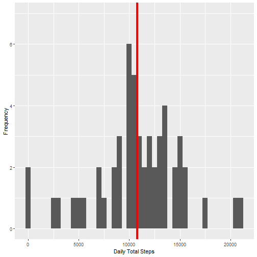
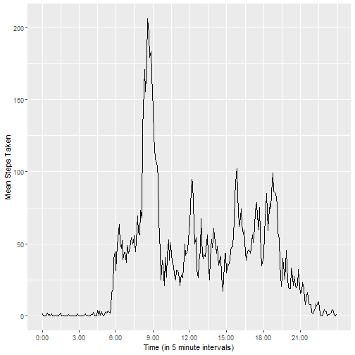
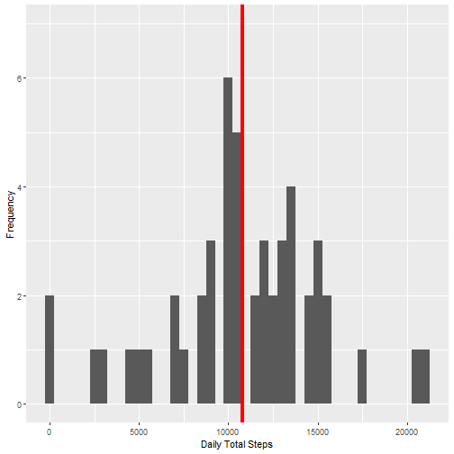
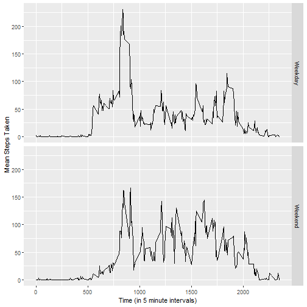

## Reproducable Research - Course Project 1

The following report is based on the questions provided in the Reproducable Research 
course's first Course Project. It is intended to showcase writing an R Markdown file 
that contains an alaysis on activity monitoring device data using knitr nd the analysis 
itself.


### Loading and preprocessing the data

The data is provided for the assignment. 

*"This assignment makes use of data from a personal activity monitoring
device. This device collects data at 5 minute intervals through out the
day. The data consists of two months of data from an anonymous
individual collected during the months of October and November, 2012
and include the number of steps taken in 5 minute intervals each day."*


```r
data <- tbl_df(read.csv("activity.csv"))

summary(data)
```

```
##      steps                date          interval     
##  Min.   :  0.00   2012-10-01:  288   Min.   :   0.0  
##  1st Qu.:  0.00   2012-10-02:  288   1st Qu.: 588.8  
##  Median :  0.00   2012-10-03:  288   Median :1177.5  
##  Mean   : 37.38   2012-10-04:  288   Mean   :1177.5  
##  3rd Qu.: 12.00   2012-10-05:  288   3rd Qu.:1766.2  
##  Max.   :806.00   2012-10-06:  288   Max.   :2355.0  
##  NA's   :2304     (Other)   :15840
```

As defined in the assignment, the variables are

```r
names(data)
```

```
## [1] "steps"    "date"     "interval"
```

where

* **steps**: Number of steps taking in a 5-minute interval (missing values 
are coded as \color{red}{\verb|NA|}NA);
* **date**: The date on which the measurement was taken in YYYY-MM-DD format;
* **interval**: Identifier for the 5-minute interval in which measurement 

was taken.


### What is mean total number of steps taken per day?

Firstly, we're interested in the mean and median steps taken on a daily 
basis. For this, we group the data by days.

```r
data_by_day <- data %>%
        group_by(date) %>%
        summarise(total = sum(steps))

head(data_by_day)
```

```
## # A tibble: 6 x 2
##   date       total
##   <fct>      <int>
## 1 2012-10-01    NA
## 2 2012-10-02   126
## 3 2012-10-03 11352
## 4 2012-10-04 12116
## 5 2012-10-05 13294
## 6 2012-10-06 15420
```

Now, we extract the number of days in the data; the number of groups in
`data_by_day` that has valid values.

```r
n <- nrow(data_by_day[!is.na(data_by_day$total), ])
```

We can determine the mean total steps taken on a single day (ignoring
NA values).

```r
original_mean <- mean(data_by_day$total, na.rm = TRUE)
```

As well as the median value:

```r
original_median <- median(data_by_day$total, na.rm = TRUE)
```

We get the following results:

* `n = 53`
* `mean = 10766.1886792453`
* `median = 10765`

We can check how this number looks like compared in a histogram. The bars represent
a 500 wide interval in which we group the different daily totals, the red vertical
line shows the mean value.

```r
qplot(data_by_day$total, geom="histogram", binwidth=500, ylim=c(0,7)) + 
        geom_vline(xintercept = original_mean, col = "Red", lwd = 1.5) +
        xlab("Daily Total Steps") +
        ylab("Frequency")
```




### What is the average daily activity pattern?

Let's see how the average steps are distributed on a timescale when we take and 
picture the intervals of 5 minutes and compare them based on how many steps are 
taken on average within them. I'm going to group by intervals, calculate the 
individual mean values for each interval, and plot them. In order to visualise 
this, I'm also going to convert the interval values to something more readable, 
into hh:mm format.


```r
to_hm <- function(x) {
        r <- character(length = length(x))
        for(i in seq_along(x)) {
                if(nchar(x[i]) == 1) { r[i] <- paste0("0:0", x[i]) }
                else if(nchar(x[i]) == 2) { r[i] <- paste0("0:", x[i]) }
                else if(nchar(x[i]) == 3) { 
                        r[i] <- paste0(substr(x[i],1,1),":",substr(x[i],2,3)) }
                else { r[i] <- paste0(substr(x[i],1,2),":",substr(x[i],3,4)) } 
        }
        r
}

data_by_interval <- data %>% 
        group_by(interval) %>% 
        summarise(mean = mean(steps, na.rm = TRUE))

ggplot(
        data = data_by_interval, 
        aes(1:288, mean)) + 
        geom_line() + 
        scale_x_continuous(
                breaks = seq(from=1, to=288, by=36), 
                labels = to_hm(data_by_interval$interval[seq(from=1, to=288, by=36)])) +
        xlab("Time (in 5 minute intervals)") +
        ylab("Mean Steps Taken")
```



And as the graph clearly shows the 5-minute interval with the highest average 
steps taken can be easily spotted.


```r
highest <- data_by_interval %>%
        filter(mean == max(mean))
highest
```

```
## # A tibble: 1 x 2
##   interval  mean
##      <int> <dbl>
## 1      835  206.
```

This seems to be in line with what we can see on the graph.


### Imputing missing values

The data has many missing (NA) values. Based on the function between the time and 
number of steps taken I think it distorts the data less if we impute with the 
interval means.

Let's see how many NA values do we have in the data, and create a new, imputed 
data set.


```r
sum(is.na(data$steps))
```

```
## [1] 2304
```

```r
impute <- function(x) {
        for(i in seq_along(x$steps)) {
                x$steps[i] <- if (is.na(x$steps[i])) {
                        round(data_by_interval$mean[
                                data_by_interval$interval == x$interval[i]],0) }
                else { x$steps[i] }
        }
        x
}

imputed_data <- impute(data)
```

Now we can calculate the mean and median values of `data_imputed` and compare 
them to the original data set.


```r
imputed_data_by_day <- imputed_data %>%
        group_by(date) %>%
        summarise(total = sum(steps))

imputed_mean <- mean(imputed_data_by_day$total)
imputed_median <- median(imputed_data_by_day$total)

data.frame(original = c(mean = original_mean, median = original_median), 
           imputed = c(mean = imputed_mean, median = imputed_median),
           difference = c(mean = (original_mean - imputed_mean),
                          median = (original_median - imputed_median)))
```

```
##        original  imputed difference
## mean   10766.19 10765.64   0.549335
## median 10765.00 10762.00   3.000000
```

The difference is due to the restriction `steps` variable has: steps taken can
only be whole, positive numbers--while the imputed mean values are not whole
numbers.


```r
qplot(imputed_data_by_day$total, geom="histogram", binwidth=500, ylim=c(0,7)) + 
        geom_vline(xintercept = imputed_mean, col = "Red", lwd = 1.5) +
        xlab("Daily Total Steps") +
        ylab("Frequency")
```




### Are there differences in activity patterns between weekdays and weekends?

For the last part of this assigment, I'm going t examine whether there's a 
visible difference between the interval-averages on weekdays and weekends. I'm
going to create a new factor variable for the imputed data and plot them on
separate panels.


```r
get_day_type <- function(x) {
        r <- character(length(x))
        for(i in seq_along(x)) {
                r[i] <- if(weekdays(as.Date(x[i])) %in% c("Saturday", "Sunday")) { 
                        "Weekend" }
                        else { "Weekday" }
        }
        r
}

day_types <- get_day_type(imputed_data$date)
imputed_data$day_type <- as.factor(day_types)
        
imputed_data_by_interval <- imputed_data %>%
        group_by(interval, day_type) %>% 
        summarise(mean = mean(steps))

ggplot(data = imputed_data_by_interval, 
        aes(interval, mean)) +
        geom_line() + 
        facet_grid(rows = vars(day_type)) +
        xlab("Time (in 5 minute intervals)") +
        ylab("Mean Steps Taken")
```



The graph shows there's a clear difference between the two categories. 
